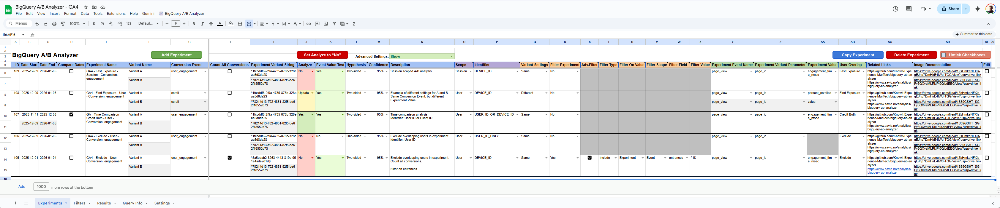
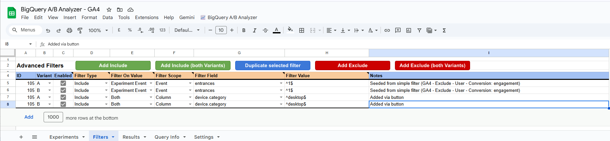
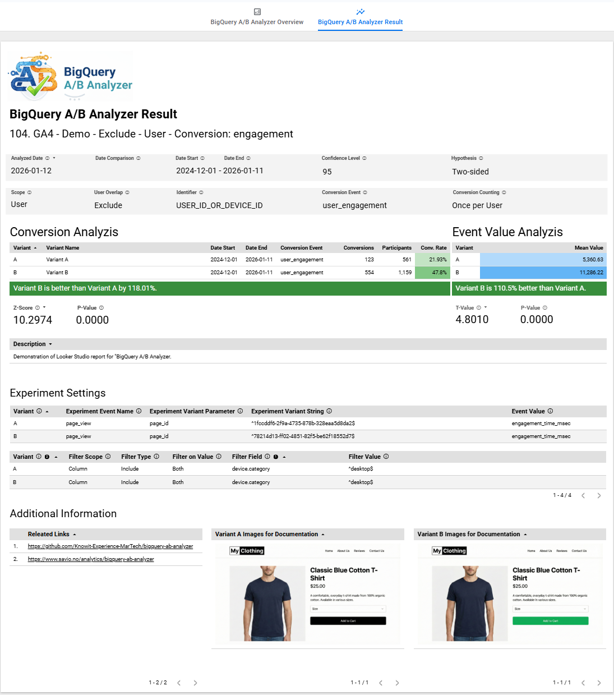
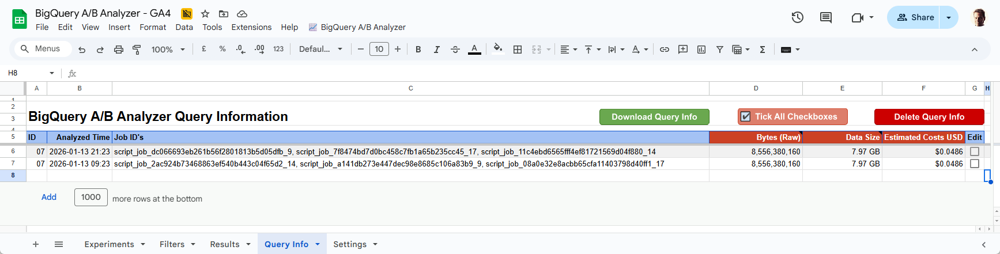

# BigQuery A/B Analyzer

## 1. Overview

A scalable, configuration-driven framework for running rigorous A/B analysis directly on BigQuery data.

The **BigQuery A/B Analyzer** decouples experiment definition from execution. It allows analysts and product owners to run sophisticated statistical analyses on millions of rows without writing a single line of SQL.

The framework supports the following tools/solutions:
* [Google Analytics](https://marketingplatform.google.com/about/analytics/) (GA4)
	* [GA4Dataform](https://ga4dataform.com/)
	* [Firebase](https://firebase.google.com/docs/ab-testing)
* [Amplitude](https://www.amplitude.com/)
* [Mixpanel](https://mixpanel.com/home/)

The solution is built around **Google Sheet**, **BigQuery** and **Looker Studio**.

## 2. Getting Started

1. Setup:
	1. [Google Cloud](01-Documentation/Google-Cloud)
	2. [Settings sheet](01-Documentation/Google-Sheet/Settings-Sheet)
2. [Documentation / using the Google Sheet solution](01-Documentation)
3. [Looker Studio / presenting results](01-Documentation/Looker-Studio)

## 3. The "Backbone": Configuration-Driven Architecture

The backbone of the system is the **Experiments Google Sheet**, which acts as a centralized registry.

* **Dynamic Scope**: You can define experiments based on URL patterns (regex) or specific event parameters or user properties.
* **Statistical Rigor**: You define the confidence level (e.g., 95% or 99%) and hypothesis type (One-sided vs. Two-sided) directly in the sheet.
* **Metrics on Demand**: You can switch between analyzing conversion rates (User X did Y) or continuous values (User X spent $Y) simply by changing a dropdown.

## 4. Key Technical Capabilities

The solution includes advanced data cleaning and filtering features.

### Filters: The "Precision Lens"

The Filters feature allows you to move beyond monolithic data by isolating specific user segments or behavior patterns directly from the spreadsheet. No SQL knowledge required.

* **Segmented Analysis**: Zoom in on specific audiences by including or excluding users based on device, geography, or traffic source (e.g., "Only count Mobile users").
* **Nested Ecommerce Deep-Dives**: You can filter by eg. <code>items.item_id</code>, <code>items.item_category</code>, or <code>items.item_brand</code> to see if a variant specifically boosted the conversion rate of a particular product or category. 
	* Only available for GA4 & GA4 Dataform.
* **Flexible Logic**: Supports both Event and User scopes, utilizing Regex for sophisticated matching (e.g., "Exclude customer type A" or "Include only specific sub-domains").
* **No Re-Coding Necessary**: Stakeholders can pivot from a site-wide analysis to a product-specific deep dive instantly, simply by updating a row in the configuration.

### User Overlap: The "Quality Control" Referee

Since this framework can analyze "natural" experiments, users might occasionally see both Version A and B.

* **The Logic**: Identifies "confused" users and applies a strict rule set to disqualify them, ensuring your results are statistically pure and free of noise.
	* **Exclude**: Remove them entirely (Scientific purity).
	* **Credit Both**: Useful for time-period comparisons.
	* **First/Last Exposure**: Attribute them to the first or last version they saw.

### Metric Flexibility: Beyond Simple Conversion Rates

Most A/B testing tools force you into a binary world: a user either converted or they didn't. But for many products, the *volume* of engagement could matter just as much as the *act* of engagement.

This solution allows you to toggle between three distinct counting methods:

1. **User Conversion Rate (Standard)**:
	* *Question*: "What % of distinct users performed the action?"
	* *Math*: Capped at 100%. (1 User = 1 Conversion, even if they clicked 10 times).
	* *Best for*: Sign-ups, subscriptions.
2. **Session Conversion Rate**:
	* *Question*: "In what % of sessions did this event occur?"
	* *Math*: Capped at 100% per session.
	* *Best for*: Landing page optimization, search usage.
3. **Total Event Rate (Count All Conversions)**:
	* *Question*: "How many times did this action happen *per user*?"
	* In this mode, the result is an **Event Rate**, not a probability. It could be perfectly normal to see a rate of 150%. This simply means the average user performed the action 1.5 times.
	* *Math*: The solution switches statistical gears here. Instead of a standard Z-test for proportions, it uses a **Z-Test for Poisson Rates** to accurately compare the intensity of user behavior, not just the presence of it.
	* *Best for*: Media consumption (Videos watched per user), E-commerce (Items added to cart), or Gaming (Levels played).
	
#### Why this distinction is critical

If you only measure "Did they click?", you might miss a huge win.

* **Scenario**: Variant A and Variant B both have 50% of users clicking "Play".
	* *Standard Tool Result*: "No Difference".
* **Reality**: In Variant B, those users watched 5 videos each, whereas in Variant A they only watched 1.
	* *This Solution's Result*: "Variant B has a 400% higher Event Rate per User".

## 5. The Statistical Engine (Calculation Method)

This is where the "magic" happens. The solution does not just count clicks; it uses a set of custom **User Defined Functions** (UDFs) in BigQuery to determine mathematical certainty based on the data type.

1. **For User Conversion (Proportions)**
	* *Method*: [Two-Proportion Z-Test](https://en.wikipedia.org/wiki/Two-proportion_Z-test) (Pooled Variance). Chosen for its objectivity and efficiency at Big Data scale. It provides clear P-values without the computational overhead of Bayesian simulations.
	* *Use Case*: Answering "Did more people sign up?" (Yes/No metrics).
	* *How it works*: Used when Scope = USER or SESSION. It calculates a Z-score to measure the difference between two probabilities, strictly capped at 100%.
2. **For Event Frequency (Intensity)**
	* *Method*: [Z-Test for Poisson Rates](https://www.statsdirect.com/help/rates/compare_crude_incidence_rates.htm) (using Log-Linear approximation).
	* *Use Case*: Answering "Did users watch more videos?" or "Did they add more items to the cart?"
	* *How it works*: Used when Scope = EVENT and  metrics can exceed 100% (e.g., 2.5 plays per user). The Incidence Rate Ratio method is specifically designed for Count Data (Poisson-like distributions) to accurately compare the intensity of user behavior.
3. **For Continuous Metrics (Values)**
	* *Method*: [Welch’s t-test](https://en.wikipedia.org/wiki/Welch%27s_t-test).
	* *Use Case*: Answering "Did users spend more money?" or "Did page load time decrease?"
	* *Why Welch's?* Standard t-tests assume both groups have the same variance (spread). In real user data, this is rarely true (e.g., a few "whales" spend a lot). Welch’s t-test is designed to be reliable even when groups have unequal variances and unequal sample sizes.

### Automatic Significance Detection 

Every time you run the analysis, the system outputs a clear verdict:

* SIGNIFICANT: The difference is real; you can trust it.
* NOT_SIGNIFICANT: The difference could be due to luck; do not make a decision yet.
* NOT_EVALUATED: Insufficient data to make a call.

## 6. Reporting

Analysed data can either be downloaded to the Google Sheet, or shown in a Looker Studio dashboard. 

The Looker Studio dashboard is designed to answer "Who won?" at a glance.

## 7. Query Information
Before running a massive historical analysis, you can toggle the **Query Information** feature. Run a 1-day sample to see the estimated size and cost, ensuring no BigQuery billing surprises.

## 8. Analysis vs. Orchestration

This solution is a statistical analysis engine, not a traffic splitting tool.

* **What it DOES NOT do**: It does not randomize users or serve different content versions on your website/app. You must use an existing mechanism (e.g., Firebase Remote Config, Optimizely, Kameleoon, Conductrics, GrowthBook or other solutions for A/B testing) if you want to orchestrate a controlled split.
* **What it DOES do**: It acts as a universal statistical layer for your analytics. It can analyze almost any event or user segment in GA4, Firebase, Amplitude or Mixpanel against statistical significance. Whether you are validating a formal A/B test, comparing time periods, or analyzing natural user cohorts, it ensures your insights are backed by rigorous math.

## 9. Prerequisites

* Access to BigQuery and your raw event data.
* Basic understanding of your event parameters.
* Ability to write simple Regular Expressions (Regex).
* *SQL competence is NOT required*.

## 10. FAQ

### 10.1. Can I "peek" at the results before the test is finished?
**Technically, yes, but proceed with caution**. Because this framework uses a **Fixed-Horizon** Frequentist model (Z-test), looking at the results daily and stopping the moment you see "Significant" increases the risk of a **False Positive** ([Type 1 error](https://en.wikipedia.org/wiki/Type_I_and_type_II_errors)). If you need to make a decision early, ensure you have reached your **Minimum Detectable Effect (MDE)** or a sufficient sample size first.

### 10.2. How do I know when the sample size is "enough"?
Statistical significance alone isn't a "stop" sign. You should define your target sample size before you run the analysis.

* **Small changes** require many users.
* **Big changes** (e.g., a completely new UI) require fewer. This solution provides the mathematical confidence, but we recommend using a "Fixed Horizon". “Fixed horizon” means either a specific sample size or a specific duration.

### 10.3. Why doesn’t this solution use Bayesian "Probability of Winning"?
Bayesian models are good for storytelling ("There is a 92% chance B is better than A"), but they are computationally expensive to run in a data warehouse. The **Two-Proportion Z-Test** was chosen because it is statistically equivalent for making business decisions while being much faster to compute in BigQuery. It allows you to analyze massive datasets without the "cost-creep" associated with more complex simulations.

### 10.4. What if the result is "NOT_SIGNIFICANT"?
This doesn't mean the test failed! It means that, based on the current data, the difference between Version A and Version B is too small to distinguish from random noise. You should either:

* Continue the test to gather more data (if you haven't reached your sample size).
* Declare a "Draw" and move on to the next hypothesis.

### 10.5. Can other tools be supported?
If the tool is having the same event data model as the already supported tools, and can export data to BigQuery, the tool can probably be supported.
However, since the BigQuery schema will be different, the [**scheduled query**](01-Documentation/Google-Cloud/01-BigQuery/01-Scheduled-queries) and the [**04_BigQuery_Download.gs**](01-Documentation/Google-Sheet/Apps-Script/04_BigQuery_Download.gs) Apps Script have to be adapted to the tool.

## 11. Summary of Benefits

* **Democratized access**: Define tests in a Google Sheet, not in SQL. Share the results in Looker Studio.
* **Standardized math**: Consistent statistical methods
* **Scalable execution**: Analyze many experiments without rewriting queries
* **Flexible metrics**: Conversion, session rates, event intensity, continuous values
* **Better data hygiene**: Overlap handling + filters built in
* **Works with your stack**: GA4, GA4 Dataform, Firebase, Amplitude, Mixpanel
* **Cost control**: No BigQuery cost surprises
* **Doesn’t try to replace** managed experimentation platforms - just complements them

Solution by [**Eivind Savio**](https://www.savio.no/analytics/bigquery-ab-analyzer) from [**Knowit AI & Analytics**](https://www.knowit.no/hva-vi-tilbyr/merkevare-og-markedsforing/maling-og-dataanalyse/). Not officially supported by Knowit AI & Analytics.
